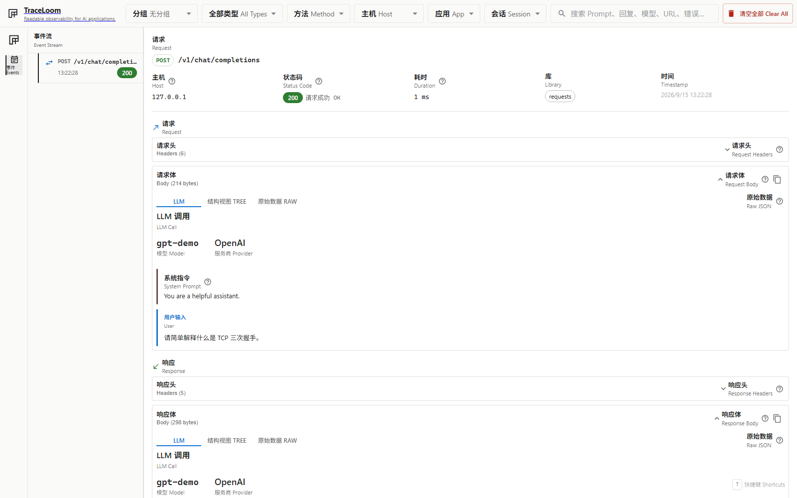

# Hierarchy and data model

TraceLoom stores captured events as a flat timeline. Each row has structural fields for
ordering and display, plus a JSON data object for event-specific fields. An optional
hierarchy object lets the same rows form runtime trees and navigation groups without
creating separate database records.

## Architecture

Hierarchy is a projection of flat event records. The Python client captures relationship
facts, the server stores and filters them, and the browser builds the visible tree.

```text
Python integrations             TraceLoom server                 Dashboard
-------------------             -------------                 ---------
start operations          ->    store flat events       ->    resolve runtime tree
attach parent span IDs          in one SQLite table            insert virtual groups
snapshot memberships            expand filtered ancestors      render recursively
```

| Layer         | Responsibility                                                                                                                  |
| ------------- | ------------------------------------------------------------------------------------------------------------------------------- |
| Python client | Creates runtime IDs, records parent IDs, inherits group memberships, and snapshots the active context before queueing an event. |
| Server        | Validates and stores the hierarchy object with each event. Filtered list queries can include the runtime ancestors of matches.  |
| Dashboard     | Resolves runtime references among loaded records, inserts the selected virtual groups, and renders the result at any depth.     |

The server returns normalized runtime references rather than resolved parent objects.
Adding parent details to every row would duplicate data and could become stale. The
dashboard builds maps keyed by trace and span ID, so it resolves the loaded records in
linear time instead of searching the list once per event.

## Runtime operations and virtual groups

Runtime correlation describes work that happened during other work. Executed tests and
HTTP calls are operations with trace and span IDs. A log or exception is an annotation
on the active operation.

Navigation grouping answers a different question: where should an event appear when you
browse by test or remote host? Test directories, files, classes, cases, and HTTP hosts
are virtual groups. They have stable IDs and labels, but no timestamps or span IDs
because TraceLoom did not execute them.

An outgoing request made during a test can therefore have both relationships:

- Its runtime parent is the test operation.
- Its group memberships place it under the test's collection path and the remote host.

Group memberships are copied onto each event. The dashboard can group a record even if
its runtime parent is absent, filtered out, outside the loaded page, or deleted by
retention.

## Hierarchy object

Every typed capture endpoint accepts an optional top-level `hierarchy` object. It may
contain runtime correlation, group memberships, or both. An empty object is invalid.

```json
{
  "hierarchy": {
    "runtime": {
      "trace_id": "4bf92f3577b34da6a3ce929d0e0e4736",
      "span_id": "00f067aa0ba902b7",
      "parent_span_id": null,
      "role": "operation",
      "origin": "traceloom"
    },
    "group_memberships": [
      {
        "kind": "pytest",
        "test_directory": {"id": "tests", "label": "tests"},
        "test_file": {
          "id": "tests/test_checkout.py",
          "label": "test_checkout.py"
        },
        "test_class": null,
        "test_case": {
          "id": "tests/test_checkout.py::test_total",
          "label": "test_total"
        }
      }
    ]
  }
}
```

Trace IDs contain 32 lowercase hexadecimal characters. Span IDs contain 16. All-zero
IDs are invalid. Operations own their span ID and may identify a parent operation.
Annotations refer to the active operation's span ID and cannot have a parent span ID.
The `origin` field records whether TraceLoom or OpenTelemetry assigned the IDs.

Each membership kind has a fixed schema:

| Kind | Levels | Used for |
| --- | --- | --- |
| `pytest` | Test directory, file, class, and case | Pytest collection grouping |
| `http_request` | Hostname | Outgoing HTTP target grouping |

Pytest directory IDs and labels both use the project-relative directory path. This keeps
separate directories such as `page_analytics/users/tests` and
`page_analytics/billing/tests` distinguishable in the dashboard.

An event can have at most one membership of each kind. A child operation inherits its
parent's memberships and replaces an inherited membership when it supplies the same
kind. Distinct kinds coexist.

The Python client's pytest integration creates one root operation before setup and keeps
it active through call and teardown. It retains that immutable context until the final
test event enters the transport queue. Context variables isolate concurrent async work,
and the hierarchy snapshot is serialized on the caller thread before background
delivery.

The Requests, HTTPX, aiohttp, botocore, and unary gRPC integrations create a child
operation around each captured call. Each adds normalized remote-host membership and
inherits all active memberships. Streaming integrations retain an immutable detached
context until delayed response-body callbacks finish. If a call raises before a
response exists, TraceLoom queues the operation with typed error details, restores the
parent context, and re-raises the same exception.

FastAPI and Django middleware create an operation around each incoming request. Logs
and exceptions emitted during any active test or HTTP operation are annotations: they
refer to that operation's span and snapshot its complete set of memberships.

## Projection and filtering rules

The dashboard always resolves runtime parent-child relationships among the loaded
records. Runtime hierarchy is not a grouping mode and cannot be switched off. The
**Group** selector can add one virtual hierarchy from the loaded result set: an available
pytest collection level or remote host. **None** removes virtual groups but keeps the
runtime tree. Selecting a deeper pytest level includes the preceding directory, file,
and class levels that are present.

For example, grouping tests by file adds virtual nodes above the test operation:

```text
tests/
`- test_requests.py                 virtual groups
   `- test_requests                runtime operation
      `- send_request              runtime operation
```

A virtual group can also start inside a runtime tree. Grouping outgoing calls by host
keeps the test as the runtime root and inserts the host where the HTTP membership begins:

```text
test_requests                      runtime operation
`- example.com                     virtual group
   `- send_request                 runtime operation
```



When a dashboard filter is active, the server also returns the runtime ancestors of each
matching record. Filtered annotations bring in their owning operation and its ancestors.
This keeps matching records connected without changing the normalized runtime references
or the event response shape. The limit applies to matching records before ancestor
expansion, so a response can contain more records than its requested limit. Contextual
ancestors may not match the active filter.

The frontend requests ancestor expansion for event type, host, method, search, app, and
session filters. The server uses a recursive SQLite query to walk from each match to its
parent operations. The query materializes runtime identity fields once, so recursive
parent lookups use SQLite's automatic indexes instead of extracting JSON while scanning
every row at each level. For annotations, the first step finds the operation with the
same trace and span ID. The response does not mark matches and contextual ancestors as
different record types. Both use the standard event envelope.

### Group insertion without reordering

The projection walks each runtime sibling sequence in its existing order. For every
record, it derives the selected membership path, keeps the common prefix with its parent,
and inserts only the virtual levels that begin or change at that point. It merges a group
with the preceding group only when both have the same stable membership ID.

This input order:

```text
example.com/1
foo.com/1
foo.com/2
example.com/2
example.com/3
```

becomes:

```text
example.com
`- example.com/1
foo.com
|- foo.com/1
`- foo.com/2
example.com
|- example.com/2
`- example.com/3
```

The two `example.com` groups remain separate because combining them would move records.
Grouping never sorts events to gather same-valued records into one group.

Counts cover only the records currently loaded in the browser.

Runtime nesting has no fixed depth. The data model uses parent span references, the tree
builder attaches children through maps, and the React renderer recurses over the result.
The practical limits are the number of loaded records and available browser space, not a
hard-coded hierarchy level.

The dashboard currently accepts one optional virtual grouping at a time. Applying
several memberships would require an explicit order, such as host then test file or test
file then host, because changing that order changes the tree. Checkboxes alone cannot
express that choice, so ordered multiple grouping remains deferred.

### Keyboard navigation

Up and Down move through visible events in the same order as the rendered projection.
They skip descendants of collapsed operations and virtual groups. Right expands a
collapsed operation, then moves to its first child when pressed again. Left collapses an
expanded operation, then moves to its runtime parent when pressed again.

Virtual group headers remain collapsible controls rather than selectable records. Event
selection, detail panels, and URL deep links continue to use event UUIDs, so keyboard
navigation selects operations and annotations rather than synthetic group nodes.
See [Keyboard shortcuts](keyboard-shortcuts.md) for the complete shortcut list.

Runtime projection is deliberately defensive. Operations whose parent is outside the
loaded records remain visible as incomplete roots. Conflicting rows with the same trace
and span identity remain separate and are marked ambiguous; annotations attach only
when the referenced operation is unique. Group nodes use stable membership IDs, while
event selection, keyboard navigation, and URL deep links continue to use event UUIDs.

Grouping is a browser-side projection of the events the dashboard has loaded, so
displayed counts are labeled **loaded records**. The dashboard accumulates a whole
session and follows it with `after_seq` deltas, so in practice that is the entire run,
but the label stays honest about what was projected. A server-side grouped endpoint
remains deferred; `GET /api/events/stats` covers whole-run counting in the meantime.

运行本地 [`hierarchy_demo.py`](../examples/python/hierarchy_demo.py)
to create an incoming request with nested logs and successful or failed outgoing child
operations. The pytest example adds collection memberships to the same runtime
relationships: [`test_pytest_tracking.py`](../examples/python/test_pytest_tracking.py)。

## Storage and read API

The server stores hierarchy under the reserved `hierarchy` key in the event's existing
JSON data column. It does not add hierarchy columns or separate group rows.

The read API projects hierarchy onto the common event envelope. Event details contain
it once, outside event-specific `data`:

```json
{
  "id": "550e8400-e29b-41d4-a716-446655440000",
  "seq": 1642,
  "timestamp": "2026-08-02T12:00:00Z",
  "event_type": "http",
  "summary": "GET /v1/charges → 200",
  "app": "shop",
  "session": "checkout",
  "hierarchy": null,
  "data": {
    "event_type": "http",
    "method": "GET",
    "url": "https://api.stripe.com/v1/charges"
  }
}
```

Rows captured before hierarchy support return `"hierarchy": null`.

### Sequence and epoch

Every event carries `seq`, its position in capture order. `seq` is SQLite's `rowid`, not a
stored column, so it costs no schema change and no migration. It exists because timestamps
cannot order a run: the client stamps them at one-second resolution and delivers events
from a background thread, so a fast run puts many events on the same timestamp in an order
that does not match capture order. Event listings therefore sort by timestamp and `seq`
together, and `seq` is the cursor a client passes back as `after_seq` to receive only what
has arrived since.

A cursor is only meaningful while the rows below it still exist, so list responses also
carry an `epoch`. It is an opaque token of the form `<instance-id>:<counter>` — an
eight-character hexadecimal id fixed when the server process starts, and a counter
incremented whenever stored events are removed wholesale. Clients compare it for equality
and nothing else; its internal shape is not part of the contract.

| Event | Effect on epoch |
| --- | --- |
| Events captured | Unchanged |
| Clear all events | Counter incremented |
| Retention prune that removed rows | Counter incremented |
| Retention prune that removed nothing | Unchanged |
| Server restart | New instance ID |

The epoch lives in the server process's memory. It is deliberately not persisted: a
restart may follow a `VACUUM` or a swapped database file, either of which renumbers
`rowid`, so treating a restart as an epoch change is the correct conservative answer.

A client that sees an epoch different from the one accompanying its stored events must
discard them and fetch again without a cursor. Values can only disappear across an epoch
change, so a client accumulating state must replace rather than merge it.

Two limits follow from holding the epoch in memory. Separate server processes sharing one
database file keep independent epochs, so neither reflects the other's deletions, and rows
removed outside a TraceLoom server — by hand, or by a future `VACUUM` — change no epoch at
all. A client guards both by treating a `max_seq` below its own cursor as impossible and
resyncing, since deletion is the only way that can happen.

## Wire examples

The examples omit headers, bodies, versions, and timing fields that do not affect the
relationship.

### Parameterized pytest invocation

```json
{
  "data": {
    "test_id": "tests/test_checkout.py::TestCheckout::test_total[usd]",
    "parameter_id": "usd",
    "status": "passed"
  },
  "hierarchy": {
    "runtime": {
      "trace_id": "11111111111111111111111111111111",
      "span_id": "aaaaaaaaaaaaaaaa",
      "parent_span_id": null,
      "role": "operation",
      "origin": "traceloom"
    },
    "group_memberships": [
      {
        "kind": "pytest",
        "test_directory": {"id": "tests", "label": "tests"},
        "test_file": {
          "id": "tests/test_checkout.py",
          "label": "test_checkout.py"
        },
        "test_class": {
          "id": "tests/test_checkout.py::TestCheckout",
          "label": "TestCheckout"
        },
        "test_case": {
          "id": "tests/test_checkout.py::TestCheckout::test_total",
          "label": "test_total"
        }
      }
    ]
  }
}
```

The invocation is the operation. The test case membership identifies its
unparameterized definition, while `parameter_id` identifies this execution.

### Outgoing request during the test

```json
{
  "duration_ms": 84,
  "request": {
    "method": "POST",
    "url": "https://api.stripe.com/v1/charges"
  },
  "hierarchy": {
    "runtime": {
      "trace_id": "11111111111111111111111111111111",
      "span_id": "bbbbbbbbbbbbbbbb",
      "parent_span_id": "aaaaaaaaaaaaaaaa",
      "role": "operation",
      "origin": "traceloom"
    },
    "group_memberships": [
      {
        "kind": "pytest",
        "test_directory": {"id": "tests", "label": "tests"},
        "test_file": {
          "id": "tests/test_checkout.py",
          "label": "test_checkout.py"
        },
        "test_class": {
          "id": "tests/test_checkout.py::TestCheckout",
          "label": "TestCheckout"
        },
        "test_case": {
          "id": "tests/test_checkout.py::TestCheckout::test_total",
          "label": "test_total"
        }
      },
      {
        "kind": "http_request",
        "hostname": {"id": "api.stripe.com", "label": "api.stripe.com"}
      }
    ]
  }
}
```

The HTTP operation inherits the pytest membership and adds its own remote-host
membership.

### Log emitted inside the request

```json
{
  "data": {"level": "INFO", "message": "charge accepted"},
  "hierarchy": {
    "runtime": {
      "trace_id": "11111111111111111111111111111111",
      "span_id": "bbbbbbbbbbbbbbbb",
      "parent_span_id": null,
      "role": "annotation",
      "origin": "traceloom"
    },
    "group_memberships": [
      {
        "kind": "pytest",
        "test_directory": {"id": "tests", "label": "tests"},
        "test_file": {"id": "tests/test_checkout.py", "label": "test_checkout.py"},
        "test_class": {"id": "tests/test_checkout.py::TestCheckout", "label": "TestCheckout"},
        "test_case": {"id": "tests/test_checkout.py::TestCheckout::test_total", "label": "test_total"}
      },
      {
        "kind": "http_request",
        "hostname": {"id": "api.stripe.com", "label": "api.stripe.com"}
      }
    ]
  }
}
```

The log refers to the request operation and snapshots both active memberships. It does
not create another operation.

### Standalone outgoing request

```json
{
  "hierarchy": {
    "runtime": {
      "trace_id": "22222222222222222222222222222222",
      "span_id": "cccccccccccccccc",
      "parent_span_id": null,
      "role": "operation",
      "origin": "traceloom"
    },
    "group_memberships": [
      {
        "kind": "http_request",
        "hostname": {"id": "example.com", "label": "example.com"}
      }
    ]
  }
}
```

Without an active parent, the request starts a trace and has only its HTTP membership.

### Outgoing request that raises

A failed outgoing call supplies `error`. Calls that fail before a response exists omit
`response`, so the server stores a null status code and empty response fields. Libraries
can also raise because of a response. Those captures include both outcomes, which keeps
the response status and headers alongside the exception details.

```json
{
  "duration_ms": 5001,
  "request": {
    "method": "POST",
    "url": "https://api.stripe.com/v1/charges"
  },
  "response": null,
  "error": {
    "type": "ConnectTimeout",
    "message": "connection timed out",
    "module": "httpx"
  },
  "hierarchy": {
    "runtime": {
      "trace_id": "11111111111111111111111111111111",
      "span_id": "bbbbbbbbbbbbbbbb",
      "parent_span_id": "aaaaaaaaaaaaaaaa",
      "role": "operation",
      "origin": "traceloom"
    }
  }
}
```

The capture payload must contain `response`, `error`, or both.
