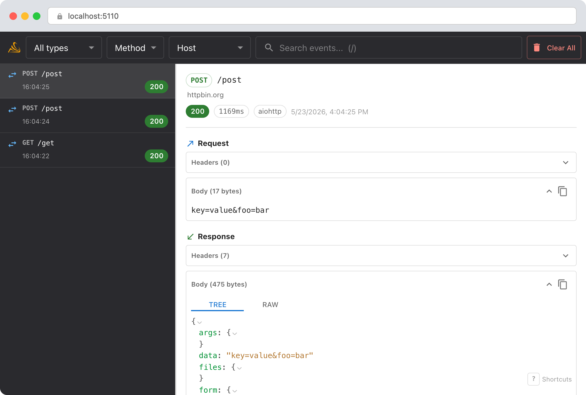
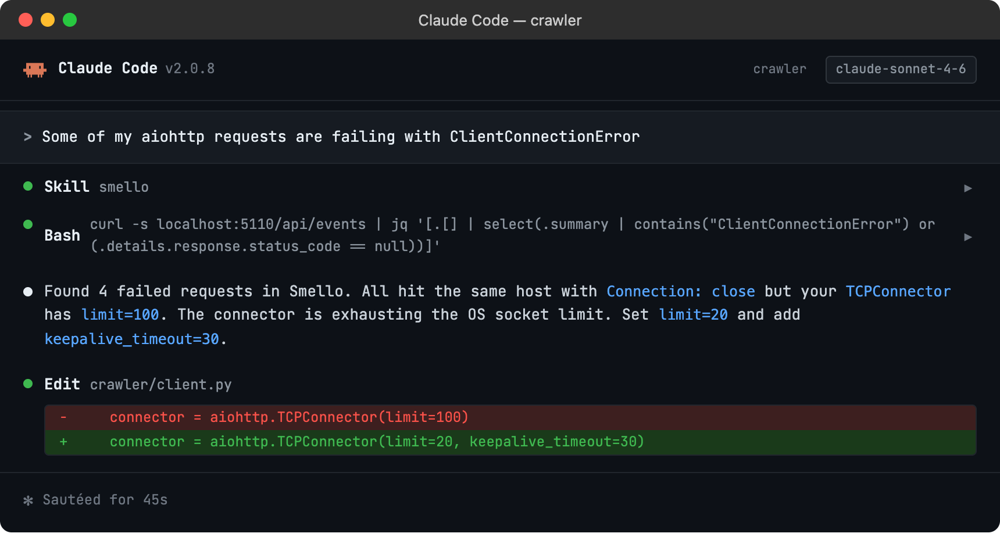

# Debug aiohttp with TraceLoom

`aiohttp` is a popular async HTTP client and server framework for Python. TraceLoom injects a native `TraceConfig` into each client session to capture request lifecycle events, redirects, streaming responses, and connection failures.

## Setup

```bash
uv sync --frozen
traceloom-server  # start the dashboard
```

Then run your script with `traceloom run`:

```bash
traceloom run my_app.py
```

All requests made via `aiohttp.ClientSession` are captured automatically. No code changes needed.

> **Example script**: [`basic_aiohttp.py`](../../examples/python/basic_aiohttp.py)

## Scenario: debugging connection pooling issues

You're making many concurrent requests with aiohttp and some are failing with `ClientConnectionError`. Is the target server throttling you? Are connections being reused properly?

```python
async with aiohttp.ClientSession() as session:
    tasks = [session.get(f"https://api.example.com/items/{i}") for i in range(100)]
    responses = await asyncio.gather(*tasks, return_exceptions=True)
    # Some responses are ClientConnectionError: which ones?
```

### Debug in the dashboard

Open the TraceLoom dashboard. You can see every request that succeeded and every one that failed:



- **Filter by status code**: quickly find the 5xx or failed requests among hundreds.
- **Timing patterns**: sort by duration to spot requests that hung before failing.
- **Host filter**: if your code calls multiple services, filter to just `api.example.com` to focus.
- **Remote host group**: wraps adjacent loaded records by destination inside their runtime parent operations.

### Debug with an AI agent

If you use [Claude Code](https://claude.ai/code) or another AI coding tool, the `/traceloom` skill can query captured events and cross-reference them with your source code. Install it once:

```bash
Copy `skills/traceloom/SKILL.md` into your agent's skills directory.
```

Then ask your agent:

```
/traceloom
Some of my aiohttp requests are failing with ClientConnectionError
```



The skill is also invoked automatically when your agent recognizes a debugging question, but calling `/traceloom` explicitly gives the best results. See [AI Agent Skills](../ai-skills.md) for compatible tools.

## Tips

- **Session methods**: TraceLoom captures requests regardless of which session method you use (`get`, `post`, `put`, `request`, etc.). The injected trace signals observe them through the same aiohttp lifecycle.
- **Connector limits**: If you're debugging throughput, pair the TraceLoom timeline with aiohttp's `TCPConnector(limit=...)` setting to understand how connection limits affect your request patterns.
- **Response body reading**: TraceLoom retains the request's detached runtime context until the response is read, released, or closed. A response closed without reading still produces an event, although its body may be empty.
- **Raised calls**: Connection errors and `raise_for_status` failures produce typed failed operations before aiohttp re-raises the original exception.

--8<-- "includes/guide-next-steps.md"
