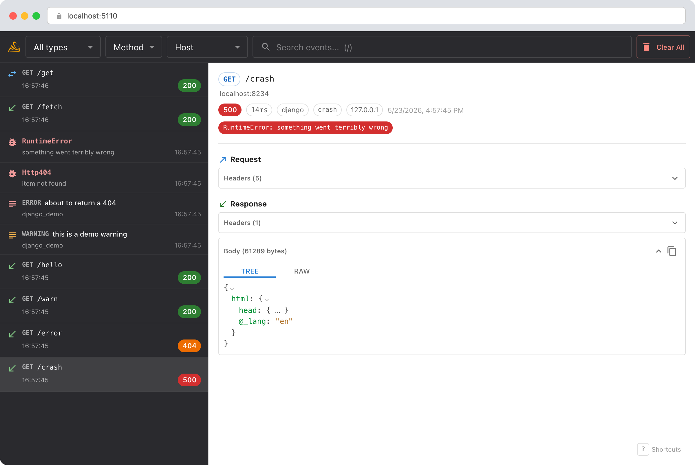
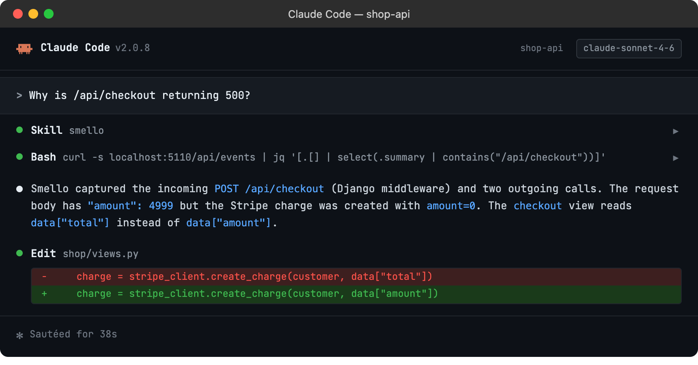

# Debug Django with TraceLoom

TraceLoom's Django middleware captures incoming HTTP requests to your Django application: the request path, headers, body, response, and timing. Combined with the automatic outgoing HTTP capture, you get a complete view of what your API endpoint received and what external calls it made to handle it.

## Setup

```bash
uv sync --frozen
traceloom-server  # start the dashboard
```

Add the TraceLoom middleware at the top of your `MIDDLEWARE` list, before `SecurityMiddleware`:

```python
# settings.py
MIDDLEWARE = [
    "traceloom.integrations.django.TraceLoomMiddleware",  # first — sees the raw request
    "django.middleware.security.SecurityMiddleware",
    "django.contrib.sessions.middleware.SessionMiddleware",
    "django.middleware.common.CommonMiddleware",
    "django.middleware.csrf.CsrfViewMiddleware",
    "django.contrib.auth.middleware.AuthenticationMiddleware",
    # ...
]
```

Placing it first means TraceLoom captures the raw request before other middleware modifies it, and sees the final response after all middleware has run. If you use a reverse proxy middleware (e.g., `django-xff` or `whitenoise`), put TraceLoom right after it so `REMOTE_ADDR` reflects the real client IP.

Then run your server with `traceloom run`:

```bash
traceloom run manage.py runserver
```

Incoming request capture is the one integration that requires a code change: adding the middleware line. Outgoing HTTP, exceptions, and logs are all captured automatically by `traceloom run`.

> **Example script**: [`django_server.py`](../../examples/python/django_server.py)

## Scenario: debugging a 500 error on a checkout endpoint

Your `/api/checkout` endpoint returns 500 intermittently. The logs say "internal server error" but don't show what went wrong. What did the client send? What external calls did your handler make?

```python
def checkout(request):
    data = json.loads(request.body)
    customer = stripe_client.get_customer(data["customer_id"])
    charge = stripe_client.create_charge(customer, data["amount"])
    send_confirmation_email(customer.email, charge.id)
    return JsonResponse({"charge_id": charge.id})
```

### Debug in the dashboard

Open the TraceLoom dashboard. You'll see the incoming request and all the outgoing calls it triggered:



- **Incoming request**: the full `POST /api/checkout` with the request body, headers, and the 500 response. Check the request body to see if the client sent valid data.
- **Outgoing calls**: the Stripe API call and the email service call appear in the timeline right after the incoming request. Did the Stripe call succeed but the email call fail?
- **Exception capture**: if the 500 was caused by an unhandled exception, TraceLoom captures the full traceback. You'll see the exception type, message, and stack frames in the dashboard.
- **Duration**: the incoming request shows total duration. Compare it with the outgoing call durations to understand where time was spent.

Outgoing calls always appear beneath the incoming Django request that triggered them.
Logs and unhandled exceptions attach to the active request operation. Choose **Remote
host** to insert destination groups around adjacent outgoing calls without changing
their execution order.

### Debug with an AI agent

If you use [Claude Code](https://claude.ai/code) or another AI coding tool, the `/traceloom` skill can query captured events and cross-reference them with your source code. Install it once:

```bash
Copy `skills/traceloom/SKILL.md` into your agent's skills directory.
```

Then ask your agent:

```
/traceloom
Why is /api/checkout returning 500?
```



The skill is also invoked automatically when your agent recognizes a debugging question, but calling `/traceloom` explicitly gives the best results. See [AI Agent Skills](../ai-skills.md) for compatible tools.

## Tips

- **Exception visibility**: The Django middleware uses `process_exception` to capture exceptions that propagate through your views. These appear as exception events in the dashboard with full tracebacks, linked to the incoming request that triggered them.
- **Route matching**: The captured incoming request shows the matched URL pattern (e.g., `users/<int:pk>`) alongside the actual URL. This helps when debugging path parameter issues.
- **Middleware order**: Add `TraceLoomMiddleware` first in your `MIDDLEWARE` list, before other middleware that might modify the request or response. TraceLoom captures what it sees, so putting it first gives you the raw client request.
- **Filtering**: Use the event type filter in the dashboard to focus on incoming requests only, or use the timeline view to see incoming and outgoing requests interleaved.
- **Hierarchy views**: Runtime parenthood is always visible. Remote host is an optional virtual navigation group, and its loaded-record count is not a whole-run total.
- **Streaming responses**: `StreamingHttpResponse` and `FileResponse` bodies are not captured (the body field shows `[streaming]`). All other metadata — status, headers, duration, route — is still captured.
- **Health checks**: If your app has health check endpoints that generate noise, add `TRACELOOM_IGNORE_PATHS` to your settings to exclude them:

```python
# settings.py
TRACELOOM_IGNORE_PATHS = ["/health/", "/admin/", "/static/"]
```

--8<-- "includes/guide-next-steps.md"
