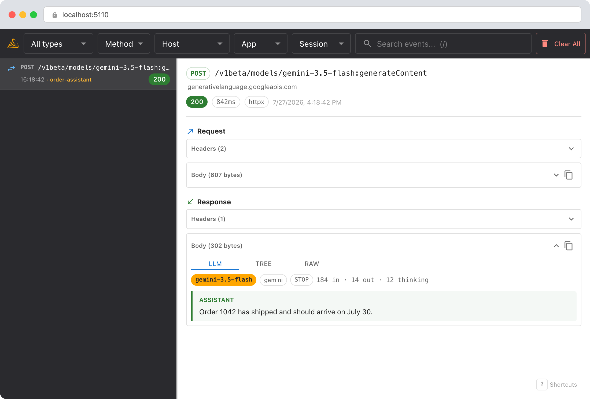
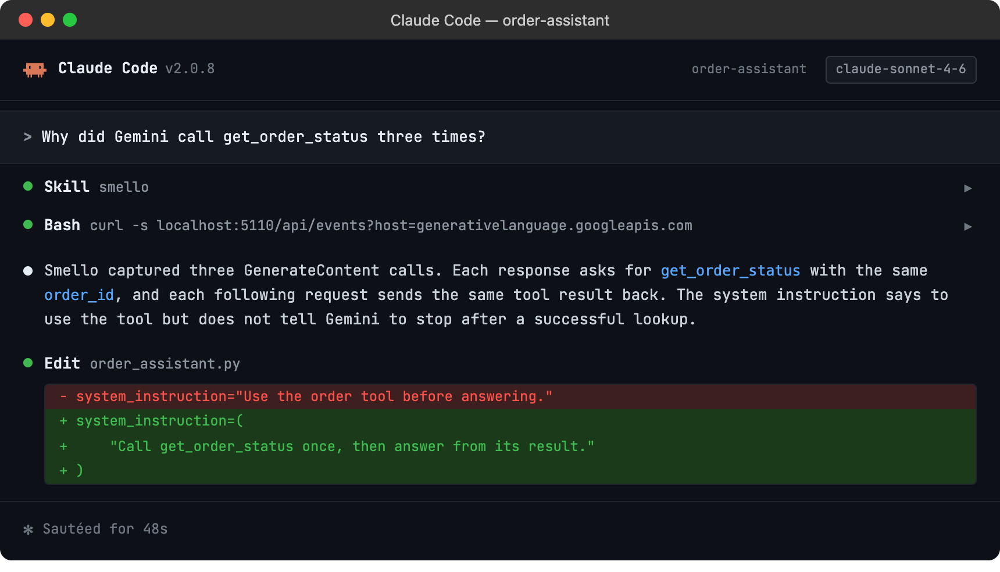

# Debug the Gemini API with TraceLoom

The Google Gen AI Python SDK turns short `generate_content()` calls into structured HTTP requests with system instructions, conversation history, tools, and usage metadata. TraceLoom captures those requests through the SDK's `httpx` or `aiohttp` transport and displays GenerateContent payloads as a readable LLM conversation.

## Setup

```bash
pip install google-genai
uv sync --frozen
traceloom-server  # start the dashboard
```

Then run your script with `traceloom run`:

```bash
traceloom run my_gemini_app.py
```

No TraceLoom imports or code changes are needed. The Google Gen AI SDK uses `httpx` by default and supports `aiohttp` for async calls. TraceLoom patches both clients automatically.

> **Example script**: [`basic_gemini.py`](../../examples/python/basic_gemini.py)

## Scenario: debugging repeated Gemini function calls

The Python SDK can run functions automatically when you pass callables as tools. A single `generate_content()` call may produce several Gemini API requests while the SDK sends function results back to the model. If a tool runs more often than expected, inspect the full exchange instead of adding print statements around each function.

```python
from google import genai
from google.genai import types

client = genai.Client()
response = client.models.generate_content(
    model="gemini-3.5-flash",  # Current stable Flash model
    contents="Where is order 1042?",
    config=types.GenerateContentConfig(
        system_instruction="Use the order tool before answering.",
        tools=[get_order_status],
    ),
)
```

### Debug in the dashboard

Open the TraceLoom dashboard and select a request to `generativelanguage.googleapis.com`:



- **System instructions**: confirm that Gemini received the rule you intended.
- **Messages**: follow user, model, and tool turns in order.
- **Function calls**: inspect each function name and its decoded JSON arguments.
- **Token usage**: compare input, output, cached, and thinking tokens across calls.

### The LLM conversation view

TraceLoom recognizes native Gemini GenerateContent requests, responses, and streams. The **LLM** tab separates text, thinking, function calls, function responses, and tool declarations. The response header shows the model version, finish reason, and token usage.

The **Tree** and **Raw** tabs preserve the exact captured payload. TraceLoom also captures other Gemini HTTP endpoints, but payloads from the newer Interactions API currently use these generic views.

### Debug with an AI agent

If you use [Claude Code](https://claude.ai/code) or another AI coding tool, the `/traceloom` skill can query captured events and compare the function-call sequence with your source code. Install it once:

```bash
Copy `skills/traceloom/SKILL.md` into your agent's skills directory.
```

Then ask your agent:

```
/traceloom
Why did Gemini call get_order_status three times?
```



The skill is also invoked automatically when your agent recognizes a debugging question, but calling `/traceloom` explicitly gives the best results. See [AI Agent Skills](../ai-skills.md) for compatible tools.

## Tips

- **API keys**: TraceLoom redacts the `x-goog-api-key` header by default.
- **Streaming**: GenerateContent streams are reassembled in the LLM view, so you can read the complete answer beside the captured events.
- **Automatic function calling**: One SDK method call may cause several HTTP requests. Use the timeline to see every model and tool turn.
- **Legacy SDK**: Google deprecated the `google-generativeai` package in favor of `google-genai`. New code and this guide use the current package.
- **Vertex AI**: The `google-genai` SDK can call Gemini through the Developer API or Vertex AI. TraceLoom captures either transport when it uses patched HTTP clients.

See Google's [Gemini 3.5 Flash model documentation](https://ai.google.dev/gemini-api/docs/models/gemini-3.5-flash) for the current model code and capabilities.

--8<-- "includes/guide-next-steps.md"
