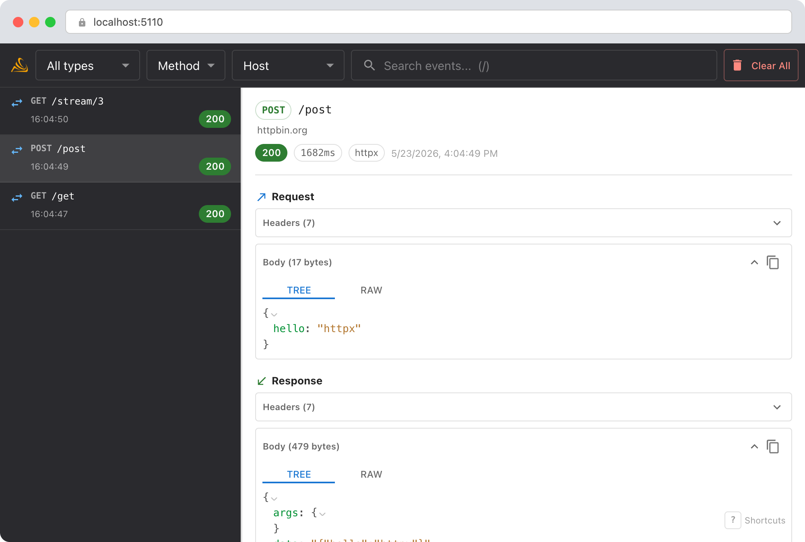
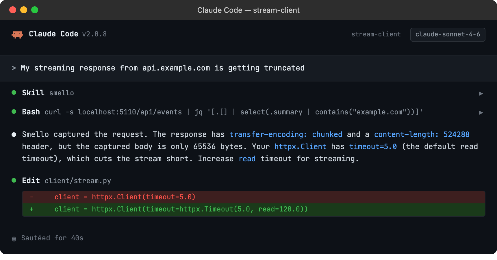

# Debug httpx with TraceLoom

`httpx` is the modern Python HTTP client with first-class async support. It's the transport layer behind the OpenAI, Anthropic, and many other SDKs. TraceLoom patches both `httpx.Client` (sync) and `httpx.AsyncClient` (async) automatically.

## Setup

```bash
uv sync --frozen
traceloom-server  # start the dashboard
```

Then run your script with `traceloom run`:

```bash
traceloom run my_app.py
```

Both sync and async httpx clients are patched. No code changes needed.

> **Example scripts**: [`basic_httpx.py`](../../examples/python/basic_httpx.py), [`async_httpx.py`](../../examples/python/async_httpx.py)

## Scenario: debugging a streaming response that stops mid-stream

You're using `httpx` to call an API that returns a streaming response, but the stream seems to cut off early. Is the server closing the connection? Is there an error mid-stream?

```python
async with httpx.AsyncClient() as client:
    resp = await client.post(
        "https://api.example.com/v1/generate",
        json={"prompt": "Write a poem", "stream": True},
    )
    # Response status is 200, but the body looks truncated
```

### Debug in the dashboard

Open the TraceLoom dashboard. The captured response shows:



- **Status code**: confirms the server returned 200 (not a 5xx mid-stream).
- **Response headers**: check `Content-Type`, `Transfer-Encoding`, and any API-specific headers like rate limit counters.
- **Response body**: the full body as received by httpx, so you can see exactly where it ended.
- **Duration**: a suspiciously short duration might indicate the connection was dropped rather than the response being complete.
- **Remote host group**: wraps adjacent loaded requests by destination inside their runtime parent operations.

### Debug with an AI agent

If you use [Claude Code](https://claude.ai/code) or another AI coding tool, the `/traceloom` skill can query captured events and cross-reference them with your source code. Install it once:

```bash
Copy `skills/traceloom/SKILL.md` into your agent's skills directory.
```

Then ask your agent:

```
/traceloom
My streaming response from api.example.com is getting truncated
```



The skill is also invoked automatically when your agent recognizes a debugging question, but calling `/traceloom` explicitly gives the best results. See [AI Agent Skills](../ai-skills.md) for compatible tools.

## Tips

- **Async and sync**: TraceLoom patches both `httpx.Client.send` and `httpx.AsyncClient.send`, so you don't need separate configuration.
- **Timeout debugging**: If a request times out, TraceLoom records a failed operation with the exception type and message, then HTTPX raises the original timeout.
- **Streaming context**: TraceLoom retains the operation context until a streaming response closes, so delayed body capture keeps the original trace, parent span, and memberships.
- **SDK traffic**: If you're debugging OpenAI or Anthropic SDK calls, those use httpx under the hood. You'll see the raw HTTP traffic in TraceLoom even though you're calling a high-level SDK.
- **HTTP/2**: httpx supports HTTP/2, and TraceLoom captures these requests the same way. The `library` field in the dashboard shows `httpx`.

--8<-- "includes/guide-next-steps.md"
