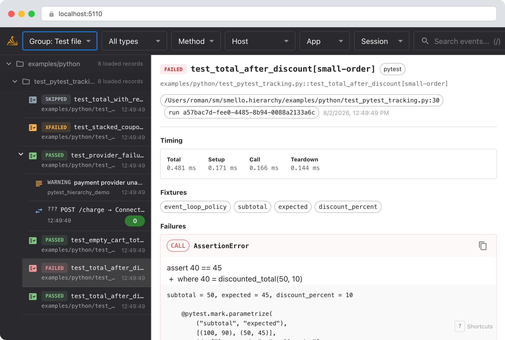
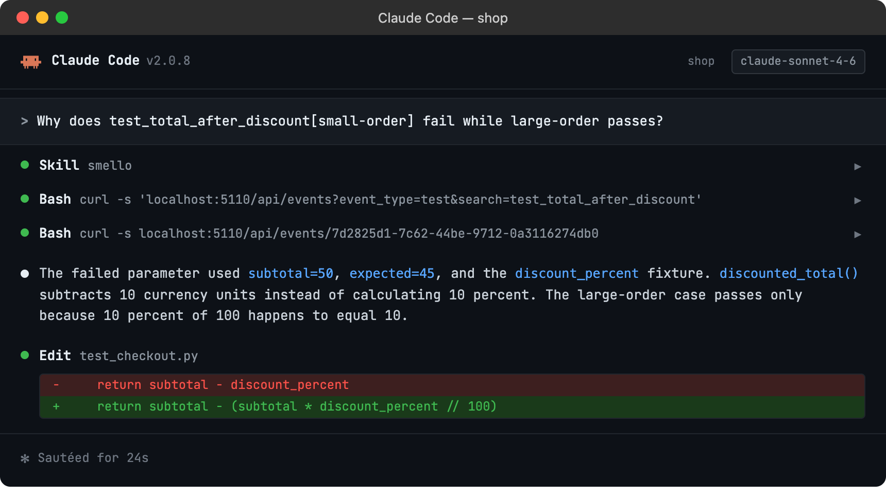

# Debug pytest tests with TraceLoom

Terminal output tells you which pytest case failed, but comparing parametrized runs or matching a failure to captured HTTP traffic requires more context. TraceLoom records each function or method invocation as a separate event with its outcome, timings, fixtures, and traceback.

## Setup

```bash
uv sync --frozen
traceloom-server  # start the dashboard
```

The bundled plugin supports pytest 7 and later.

Run pytest through TraceLoom:

```bash
traceloom run pytest tests/ -v
```

The bundled plugin loads automatically. You don't need to add a pytest plugin to `conftest.py`.

> **Example test**: [`test_pytest_tracking.py`](../../examples/python/test_pytest_tracking.py)

The example contains one intentional assertion failure and one handled provider
connection failure. Run it with log capture enabled:

```bash
traceloom run --capture-logs --log-level WARNING -- \
  pytest examples/python/test_pytest_tracking.py -v
```

## Scenario: debugging one failing parameter

Suppose a discount test passes for a large order but fails for a small order:

```python
def discounted_total(subtotal: int, discount_percent: int) -> int:
    return subtotal - discount_percent


@pytest.mark.parametrize(
    ("subtotal", "expected"),
    [(100, 90), (50, 45)],
    ids=["large-order", "small-order"],
)
def test_total_after_discount(subtotal, expected, discount_percent):
    assert discounted_total(subtotal, discount_percent) == expected
```

The first case passes by coincidence because 10 percent of 100 is 10. The second returns 40 instead of 45.

### Debug in the dashboard

Open the TraceLoom dashboard at `http://localhost:5110`, switch **Group** to **Test file**,
and select the failed parameter:



- **Test ID**: identifies the exact parameter, such as `test_total_after_discount[small-order]`.
- **Status**: distinguishes assertion failures from setup or teardown errors, skipped tests, expected failures, and unexpected passes.
- **Timing**: breaks the total into setup, call, and teardown phases.
- **Fixtures**: lists the fixture names requested by the test.
- **Failures**: shows the phase, exception type, assertion message, and traceback.

The file path appears above each test's runtime tree. **None** removes the virtual groups
while keeping runtime parenthood. In the example, `test_provider_failure_is_handled`
passes because it expects the connection error. Its runtime tree still contains the
failed Requests operation and the warning log attached to the test operation.

### Debug with an AI agent

If you use [Claude Code](https://claude.ai/code) or another AI coding tool, the `/traceloom` skill can query test events and compare the failure with your source code. Install it once:

```bash
Copy `skills/traceloom/SKILL.md` into your agent's skills directory.
```

Then ask your agent:

```
/traceloom
Why does test_total_after_discount[small-order] fail while large-order passes?
```



The skill is also invoked automatically when your agent recognizes a debugging question, but calling `/traceloom` explicitly gives the best results. See [AI Agent Skills](../ai-skills.md) for compatible tools.

## Tips

- **Parametrization**: Every parameter set gets its own event and keeps its full pytest node ID.
- **Fixture values**: TraceLoom stores fixture names as structured data. The traceback generated by pytest may also include `repr()` output for parameter, fixture, or local variable values.
- **Phase errors**: Fixture setup and teardown failures use the `error` status. Assertion and other test-body failures use `failed`.
- **Expected outcomes**: Pytest `xfail`, `xpass`, and `skip` outcomes remain distinct in the timeline.
- **pytest-xdist**: Events include the shared test run ID and worker ID, so parallel executions can be distinguished.
- **Outgoing calls**: Requests, HTTPX, aiohttp, botocore, and gRPC operations inherit the active test's collection groups. A caught network error remains visible as a failed child operation even when the test passes.
- **Runtime annotations**: Enable log capture to attach logs to the test or nested HTTP operation that emitted them.
- **Opting out**: Pass `--no-capture-tests` or set `TRACELOOM_CAPTURE_TESTS=false` to disable test events without disabling other capture types.

--8<-- "includes/guide-next-steps.md"
