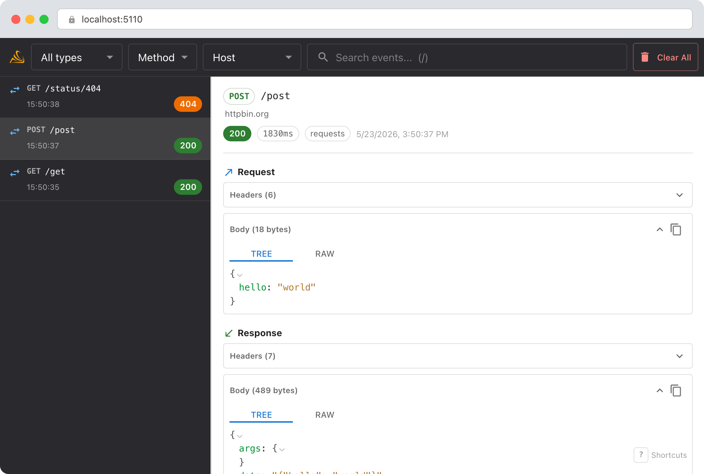
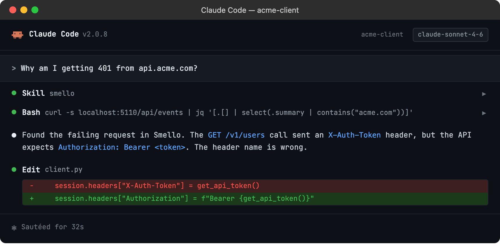

# Debug requests with TraceLoom

The `requests` library is Python's most popular HTTP client. When you're integrating with a REST API, the most common frustration is not seeing what your code actually sent: wrong headers, malformed JSON, unexpected redirects. TraceLoom captures every `requests` call automatically.

## Setup

```bash
uv sync --frozen
traceloom-server  # start the dashboard
```

Then run your script with `traceloom run`:

```bash
traceloom run my_app.py
```

Every call through `requests.get()`, `requests.post()`, or `Session.send()` is now captured. No proxy configuration, no code changes.

> **Example script**: [`basic_requests.py`](../../examples/python/basic_requests.py)

## Scenario: debugging a 401 from a REST API

You're calling a third-party API and getting `401 Unauthorized`, but you're sure you set the token. Is it a typo? Wrong header name? Expired token?

```python
session = requests.Session()
session.headers["X-Auth-Token"] = get_api_token()

resp = session.get("https://api.acme.com/v1/users")
# 401: why?
```

### Debug in the dashboard

Open the TraceLoom dashboard at `http://localhost:5110`. Click the failed request to see the full detail view:



- **Request headers**: verify the exact header name and value that was sent. Maybe the API expects `Authorization: Bearer ...` but you sent `X-Auth-Token`.
- **Request URL**: check for typos, wrong base URL, or missing path segments.
- **Response body**: many APIs include a helpful error message in the 401 response that `resp.status_code` alone doesn't show you.
- **Remote host group**: wraps adjacent loaded calls to the same destination while preserving runtime parenthood and record order.

### Debug with an AI agent

If you use [Claude Code](https://claude.ai/code) or another AI coding tool, the `/traceloom` skill can query captured events and cross-reference them with your source code. Install it once:

```bash
Copy `skills/traceloom/SKILL.md` into your agent's skills directory.
```

Then ask your agent:

```
/traceloom
Why am I getting 401 from api.acme.com?
```



The skill is also invoked automatically when your agent recognizes a debugging question, but calling `/traceloom` explicitly gives the best results. See [AI Agent Skills](../ai-skills.md) for compatible tools.

## Tips

- **Redirects**: `requests` follows redirects by default. If your request is being redirected before hitting the API, you'll see multiple captured requests: the original and each redirect hop.
- **Session reuse**: TraceLoom captures at the `Session.send()` level, so it works whether you use `requests.get()` (which creates a temporary session) or a long-lived `Session` object.
- **Raised calls**: Connection failures and timeouts produce failed operations with typed error details before Requests raises the original exception.
- **Binary responses**: Non-JSON response bodies are shown as raw text. Large binary responses are truncated with a size indicator.
- **Header redaction**: `Authorization` and cookie headers are redacted by default. Configure `redact_headers` to add more.

--8<-- "includes/guide-next-steps.md"
